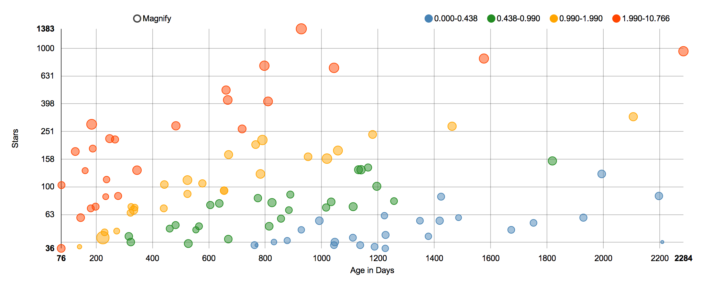
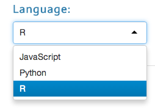
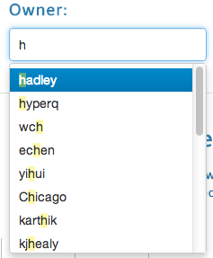
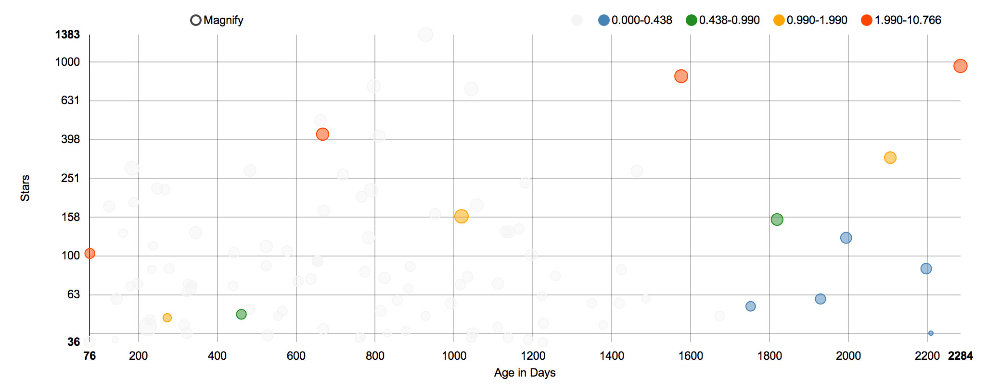
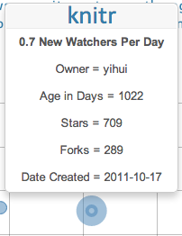
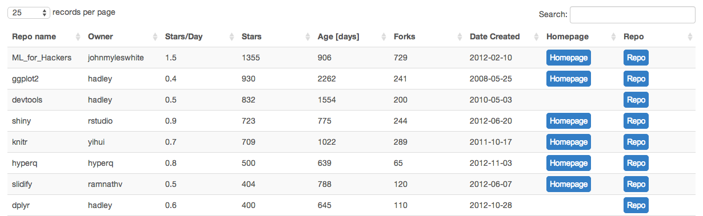

### Scatter Chart
- This chart shows repos as bubbles.   
- Up means more stars. Right means older.  
- Bubble size is based on number of forks.       
- Bubbles are colored by Stars/Week.   
- Green and blue are Hot. Orange and red are not as hot.
- The new hottness will be on the lower to mid left. 
- Older staples will be on the upper to mid right

##### Why the log log axis?
It looks like this originally.  
Adding the log log allows languages at ranges to be seen clearly.  
Also adding some size to the points gives them some substance and makes it a true bubble.  

##### Why the colors?
This allows more stories to be told.   
Why do R and Matlab not have many stars per repo?  
They are more of an analysis language. They are less often used as the base language for a popular tool, which gets a lot of stars.   

#### Use the filters to drilldown
- Select the language you are interested in.
- Select an owner or multiple
- The scatter chart will update with the language and filter to the selected owners

#### Tooltips
- Hover over a bubble to see details 
- (If you do not see a tooltip... select and de-select **magnify** to *wake up* the chart)  

### Table
- This will filter to the owners selected  
- Sort by any field. You can sort by multiple fields by holding shift  
- Search any field with search bar on top. (Case sensitive) 
- Search individual fields with search bars at bottom of columns  
- Click links to go directly to github repo or project homepage

  

